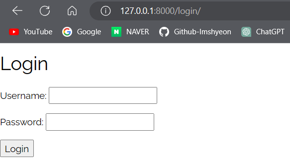
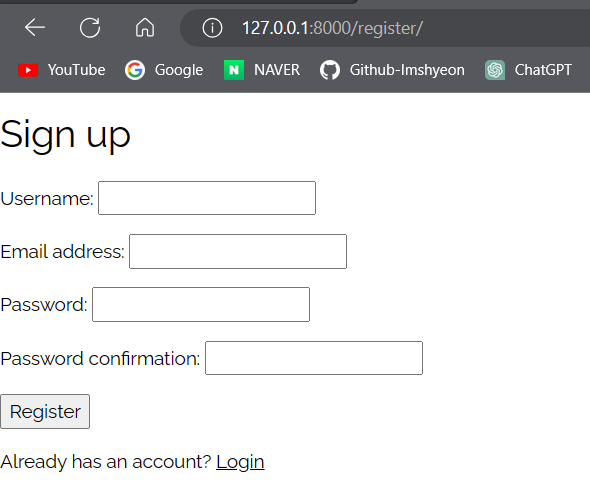
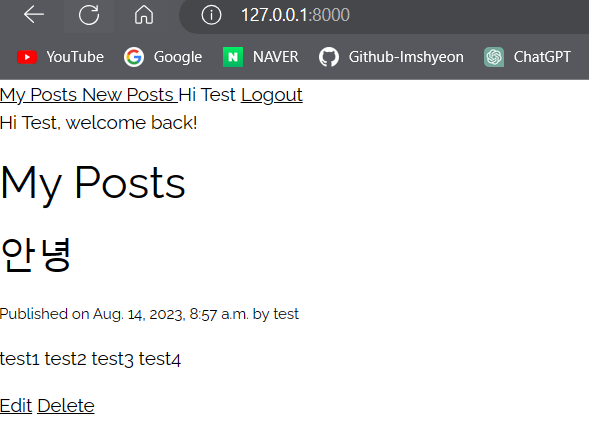

## 목차

1. [간단한 코드 설명](#1-간단한-코드-설명)
2. [코드 전문](#2-코드-전문)
3. [message를 표시하고 싶을 경우](#3-message를-표시하고-싶은-경우)

---

참고 : [Working with forms | Django documentation | Django (djangoproject.com)](https://docs.djangoproject.com/en/4.2/topics/forms/)

 
## 1. 간단한 코드 설명

### 1. forms.py

-   forms.py에서는 `from django import forms` 안의 Form 클래스를 사용한다. 이 Form instance는 is\_valid() 메소드를 가지고 있는데, 얘들은 Form의 모든 field들이 유효한지를 검사한다. 그리고 이 메소드가 불러지고 Form의 필드들이 모두 유효한 데이터를 가지고 있다면
    1.  True를 리턴
    2.  form의 데이터들은 `cleaned_data`에 위치시킨다. 따라서 아래와 views.py안에 아래와 같이 코드를 작성한 것.

```
  if form.is_valid():
            username = form.cleaned_data['username']    # form안의 cleaned_data['username']을 username이라는 변수에 대입
            password = form.cleaned_data['username']
```
<br>

### 2. login.html

-   다음과 같이 작성할 수 있다.
-   ` <div class="fieldWrapper"> {{ field.errors }} {{ field.label_tag }} {{ field }}  <p class="help"> {{ field.help_text|safe }} </p>  </div> `
-   {{ field }} 가 가진 유용한 attribute들이 있다
    1.  `{{ field.errors }}` : `<ul class="errorlist">` 가 가진 모든 유효한 에러들의 결과값들이다.``로 커스터마이징 가능하다. 이것을 이용해서 각 에러에 맞는 에러메시지 작성가능하다.
    2.  `{{ field.field }}` : form 클래스에서의 Field(속성값들?)에 관한 것이다. 따라서 Field attribute에 접근 가능. `{{ char_field.field.max_length}}`
    3.  `{{ field.help\_text }}` : field의 help text와 관련되어있다.
    4.  `{{ field.html\_name }}`
    5.  `{{ field.id\_for\_label }}` : 해당 field를 위해서 ID가 사용될 수 있다.
    6.  `{{ field.is\_hidden }}` : form field가 hidden filed거나 False 일 때 이 값이 True가ㅣ 된다.
    7.  `{{ field.label }}` : field의 라벨이다. 예를 들면 Email address 같은 것.
    8.  `{{ field.label\_tag}}` : field의 label들은 HTML의 `<laber> 태그`안에 감싸져 있다. 이것을 의미
    9.  `{{ field.value }}` : filed의 value. 예를 들면, [gildong@example.com](mailto:gildong@example.com)

<br>

---
<br>

## 2. 코드 전문

### 1. views.py

```python
from django.shortcuts import render, redirect
from .forms import LoginForm, RegisterForm
from django.contrib import messages
from django.contrib.auth import authenticate, login, logout
# Create your views here.

# =========================== login / logout ===========================
def sign_in(request):
    if request.method=='GET':
        form = LoginForm()
        return render(request, 'users/login.html', {'form' : form})

    elif request.method=='POST':
        form = LoginForm(request.POST)

        if form.is_valid():
            username = form.cleaned_data['username']
            password = form.cleaned_data['password']
            user=authenticate(request, username=username, password=password)
            if user is not None:
                login(request, user)
                messages.success(request,f'Hi {username.title()}, welcome back!')
                return redirect('posts')
            else:
                messages.error(request,"Invalid username or password")
                return render(request, 'users/login.html',{'form' : form})

def sign_out(request):
    logout(request)
    messages.success(request, f"You've been logged out")     
    return redirect('login')       


# =========================== 회원등록 ===========================
def sign_up(request,false=None):
    if request.method == 'GET':
        form = RegisterForm()
        return render(request,'users/register.html',{'form':form})
    elif request.method == 'POST' :
        form = RegisterForm(request.POST)
        if form.is_valid():
            user = form.save(commit=false)
            user.username = user.username.lower()
            user.save()
            messages.success(request,"You've signed up successfully")
            login(request,user) #signup에 성공하면 그것을 이용해서 바로 로그인
            return redirect('posts')
        else : 
            return render(request,'users/register.html',{'form':form})
```
<br>

### 2. urls.py

```python
from django.urls import path
from . import views

urlpatterns = [
    path('login/',views.sign_in,name="login"),
    path('logout/',views.sign_out, name='logout'),
    path('register/',views.sign_up, name="register")
]
```
<br>

### 3. form.py

```python
from django import forms
from django.contrib.auth.models import User
from django.contrib.auth.forms import UserCreationForm

class LoginForm(forms.Form):
    username = forms.CharField(max_length=65)
    password = forms.CharField(max_length=65, widget=forms.PasswordInput)

class RegisterForm(UserCreationForm):
    class Meta:
        model = User
        fields = ['username', 'email', 'password1','password2']  #model이 사용하는 모든 field
```
<br>

### 4. login.html

```html



<form method='POST' novalidate>
    
    <h2>Login</h2>

    
    <p>
        
        <ul class="errorlist">
            
            <li> {{error}} </li>
            
        </ul>
        
        {{ field.label_tag }} {{ field }}
    </p>
    
    <input type="submit" value="Login" />
</form>

```
<br>

### 5. register.html

```html
<!-- field가 가진 attribute 이용 -->



<form method="POST" novalidate>
    
    <h2> Sign up </h2>
    
    <p>
        
            {{field.errors}}
        
        {{field.label_tag}} {{field}}
    </p>
    
    <input type = "submit" value = "Register" />
    <p> Already has an account? <a href = ""> Login </a></p>
</form>

```

<br>

---
<br>

### 6. 결과

1. login 화면


<br>

2. logout
127.0.0.1:8000/logout을 하면 바로 login 페이지로 redirect

<br>

3. register


<br>

---

<br>

## 3. message를 표시하고 싶은 경우
- base.html
```python

<!DOCTYPE html>
<html lang="en">
<head>
    <meta charset="UTF-8">
    <meta name="viewport" content="width=device-width, initial-scale=1">
    <link rel="stylesheet" href="https://www.w3schools.com/w3css/4/w3.css">
    <link rel="stylesheet" href="https://fonts.googleapis.com/css?family=Raleway">
    <link rel="stylesheet" href="https://cdnjs.cloudflare.com/ajax/libs/font-awesome/4.7.0/css/font-awesome.min.css">
    <style>
    body,h1,h2,h3,h4,h5,h6 {font-family: "Raleway", sans-serif}
    </style>
    <script src="" defer></script>
    <title>My Site</title>
</head>
<body>
    <header>
        
            <a href=""> My Posts </a>
            <a href=""> New Posts </a>
            <span> Hi {{ request.user.username | title }} </span>
            <a href=""> Logout </a>
        
            <a href=""> Login </a>
            <a href=""> Register </a>
        
    </header>
<main>
    
        <div class = "messages">
            
                <div class="alert  alert-{{message.tags}}">
                    {{ message }}
                </div>
            
        </div>
    
    
    
</main>
</body>
</html>
```

<br>


### 1. 결과
