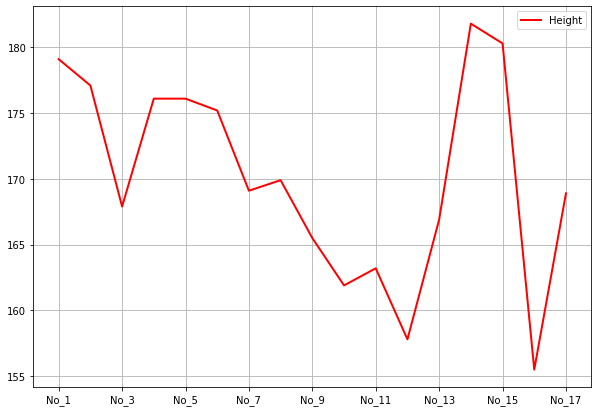
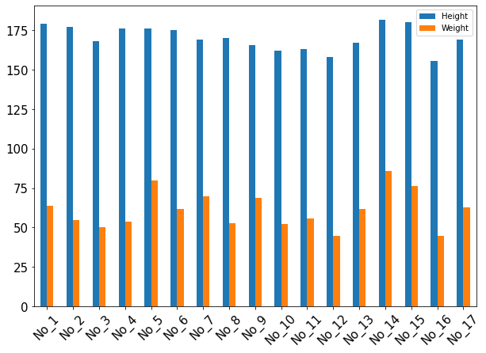
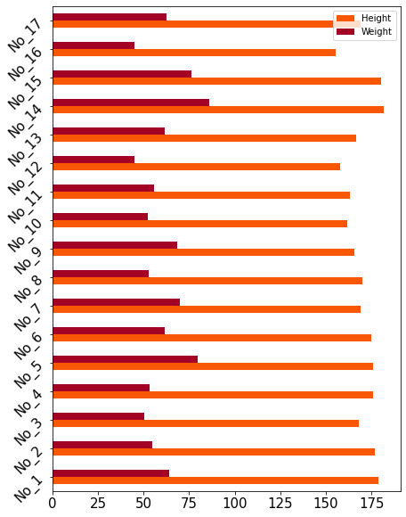
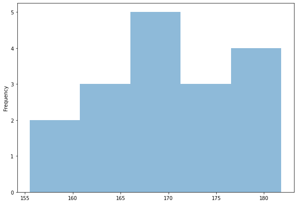
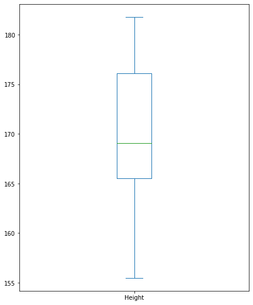
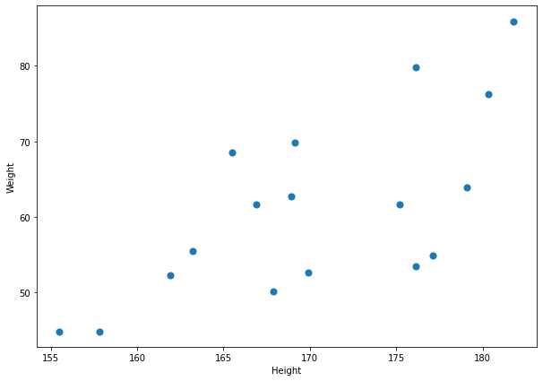
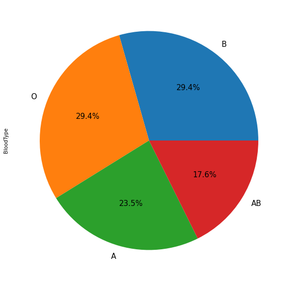

# Numpy
1. 특징
  - 수학 및 과학적 연산을 쉽고 빠르게 지원한다.
  - 다차원 행렬을 효과적으로 처리한다.
  - 일반적으로 같은 데이터 타입(연속형 &rarr; 숫자데이터) 값을 구성된다.


## 1. 행렬
<p align="center">
    
</p>

1. Scalar - 0D Array - Rank0 Tensor
    ```python
        a0 = np.array(9)
    ```
2. Vector - 1D Array - Rank1 Tensor
    ```python
        a1 = np.array([1, 3, 5, 7, 9])
    ```
3. Matrix - 2D Array - Rank2 Tensor
    ```python
        a2 = np.array([[1, 2, 3],
                       [4, 5, 6],
                       [7, 8, 9]])
    ```
4. Array - 3D Array - Rank3 Tensor
    ```python
       a3 = np.array([[[1, 2],
                       [3, 4]],
                       [[5, 6],
                       [7, 8]],
                       [[9, 10],
                       [11, 12]]])
    ```
    - a[축, 행, 열] 순이다. 

<br>

## 2. shape, reshape, size, ndim, flatten
1. 만약 `array.shape` = (12,)이면 &rarr; 1차원의 Array이고 벡터 형태이다.

2. reshape(행,열)
   - `array.shape` = (3,4) &rarr; 3행 4열이고 ndim = 2이다.
   - ``.reshape(-1,1)` : 열은 지정했는데, 행 = -1 이면 '열의 값에 행을 맞춘다.' 라는 의미이다.

3. `.size` : 행렬의 요소의 개수
4. `.ndim` : 행렬의 차원
5. `.flatten` : 어떤 shape이던지 1차원으로 쭉 핀다.

<br>

## 3. 범위지정
1. `numpy.arange(n)` : 연속된 n개의 값 생성. for문의 range와 같다.

## 4. 특별한 형태의 Array 생성
1. `numpy.zeros` : 0으로만 구성
2. `numpy.ones` : 1로만 구성
3. `numpy.eye` = 3x3 단위행렬
4. 난수행렬
 - `numpy.random.rand` : 실수 난수
 - `numpy.random.randint` : 정수 범위의 난수 &rarr; 복원추출 형태로 동작(뽑은 것도 중복되어 또 뽑힐 수 있다)
   - `np.random.choice(np.arange(1, 46), size = (5 ,6), replace = False)` : replace = 복원 x
 - `numpy.random.seed` : 의사난수(Pseudo Random Number, 가짜 난수) 생성 초기값 지정 &rarr; 항상 같은 형태로 랜덤값을 만듦
 - `numpy.random.suffle` : 원소 섞기

## 5. Array 연산
1. 기본 연산 : 각각의 행과 열의 값을 매칭해서 산술 연산을 수행한다. 
2. 통계량 연산 : sum, mean, var(분산), std(표준편차), min, max, 중앙값, 최빈값, 범위
 - `min()` : 전체의 최소값
 - `min(axis=0)` : 각 열의 최소값 // axis=0 아래쪽 방향(행의 방향)으로 연산해라.. 라는 의미 &rarr; 파란색 화살표가 행의 방향
 - `min(axis=1)` : 각 행의 최소값 // axis=1 열의 방향으로 연산해라 &rarr; 초록색 화살표가 열의 방향
  
    

 - `cumsum` : 누적합
 - `cumprod` : 누적곱

## Matrix 연산
### 행렬 곱


- `M1.dot(M2)` : M1 @ M2
- `numpy.dot(M2,M1)` : M2 @ M1

### 전치 행렬


- `numpy.transpose(M1)` : M1의 전치행렬
- `M2.transpose()` : M2의 전치행렬 == M2.T

<br>
<br>


# Pandas
1. 목적
   1. **외부의 데이터를 python으로 읽어오는 역할을 한다.**
   2. 분석, Modeling Data를 위한 전처리(Preprocessing) 기능을 제공해준다.

<br>

2. pandas - DataFrame (pandas에서 읽어들어오면 DataFrame)
   - Lable Index를 가진 2차원 구조
   - 일반적으로 다양한 데이터 타입의 열들로 구성 (문자, 숫자형)
  
   1. CSV(Comma Seperated Values) : 실제로 메모장에 CSV 파일을 열어보면 , 로 데이터들이 분류되어 있다.
      1. `.read_csv()` &rarr; type(DF1) : pandas.core.frame.DataFrame | [pandas.read_csv](https://pandas.pydata.org/docs/reference/api/pandas.read_csv.html)
      2. `.to_csv()` : CSV 파일로 저장 | [pandas.to_csv](https://pandas.pydata.org/docs/reference/api/pandas.DataFrame.to_csv.html#pandas.DataFrame.to_csv)
        
    2. Excel
       1. `.read_excel()` | [pandas.read_excel](https://pandas.pydata.org/docs/reference/api/pandas.read_excel.html)
       2. `.to_excel()` | [pandas.to_excel](https://pandas.pydata.org/docs/reference/api/pandas.DataFrame.to_excel.html)

    3. DataFrame Information
       1. `info()` : DataFrame의 정보를 볼 수 있다. 행과 열에 대한 정보
            ```shell
                <class 'pandas.core.frame.DataFrame'>
                RangeIndex: 17 entries, 0 to 16
                Data columns (total 8 columns):
                #   Column     Non-Null Count  Dtype    # (데이터타입)  
                ---  ------     --------------  -----  
                0   Name       17 non-null     object   # (문자)
                1   Gender     17 non-null     object 
                2   Age        17 non-null     int64    # (숫자) 
                3   Grade      17 non-null     int64  
                4   Picture    17 non-null     object 
                5   BloodType  17 non-null     object 
                6   Height     17 non-null     float64  # (실수)
                7   Weight     17 non-null     float64
                dtypes: float64(2), int64(2), object(4) # -> DataType summary
                memory usage: 1.2+ KB
            ```
        2. `.index` : 행 정보
        3. `.columns` : 열 정보
        4. `.values` : (numpy) Array &rarr; 하나의 리스트 안에 문자와 숫자가 섞임. 행(record)으로 보면 문자와 숫자가 섞여있고 열(column)로 보면 섞여있지 않다. &rarr; '연산은 column 단위로 이뤄질 것이다' 를 유추 가능

    4. Function
        1. `.head()` : 위에서 5행 출력
        2. `.tail()` : 밑에서 5행 출력
        3. `.sort_values()`
            - `.sort_values() / .sort_values(ascending = True)` : 오름차순
            - `.sort_values(ascending = False)` : 내림차순
        4. `.describe()` : 숫자 데이터만 가지고 통계량 분석
        5. `.mean()` : 평균
        6. `.median()` : 중간값
        7. `.var()` : 분산
        8. `.std()` : 표준편차

    5. Indexing & Slicing
    - iloc : 보이지 않는 인덱스, 수정 불가능 &rarr; 절대값
    - loc : 보이는 인덱스, 수정 가능
        1. Label(index) 변경
            ```python
                LABEL = ['No_1', 'No_2', 'No_3', 'No_4', 'No_5', 'No_6', 'No_7', 'No_8', 'No_9', 'No_10', 'No_11', 'No_12', 'No_13', 'No_14', 'No_15', 'No_16', 'No_17']

                DF1.index = LABEL
            ```
        2. loc(Location) : 얼마든지 바꿀 수 있다.
            - Label 값 기준
            - loc - indexing : 값 하나를 찍음
              - `.loc[행 laber, 열 label]` 
            - loc - Slicing : 범위
              - `.loc[행 시작 : 행 끝 , 열 시작 : 열 끝]` : 시작 이상 끝 **이하** &rarr; 끝을 포함

        3. iloc(Integer Location)
            - Index값 기준
            - iloc - indexing
              - `.iloc[헹, 열]`
            - iloc - Slicing
              - `.iloc[행 시작 : 행 끝, 열 시작, 열 끝]` : 시작 이상 끝 **미만** &rarr; 끝을 포함 X
    
<br>

3. pandas - Series
   - Label index를 가지는 1차원 구조
   - 최소 단위 : column 하나가 시리즈 이다.
   - 일반적으로 동일한 데이터 타입으로 구성
   - Dataframe(일종의 표, table)은 여러개의 Series로 구성되어있다. &rarr; Series가 두 개 이상 묶이면, 그것은 DataFrame이다.

   1. Series from DataFrame
        1. `DataFrame_Name['Column_Name']` &rarr; type() : pandas.core.series.Series
        2. `DataFrame_Name.Column_Name`
        3. 두 개 이상의 시리즈 : `DataFrame_Name['Column_Name1', 'Column_Name2']` &rarr; type은 DataFrame

   2. Function
        1. `.count()`
        2. `.sum()`
        3. `.mean()`
        4. `.median()`
        5. `.var()`
        6. `.std()`
        7. `.min()`
        8. `.max()`
        9. `.idxmin()` : 시리즈 최솟값의 인덱스 주소를 반환한다.
        10. `.idxmax()` : 시리즈 최댓값의 인덱스 주소를 반환한다.
        11. `.sort_values()`
            - `.sort_values(ascending = True)` : 오름차순
            - `.sort_values(ascending = False)` : 내림차순

   3. Indexing & Slicing
        1. loc(Location)
            - loc - indexing : `DataFrame_Name.Column_Name.loc['라벨']`
            - loc - Slicing : `DataFrame_Name.Column_Name.loc['라벨 시작' : '라벨 끝']` &rarr;  시작 이상 시작 **이하**
        2. iloc(Integer Location)
            - iloc - indexing : `DataFrame_Name.Column_Name.iloc['라벨']`
            - iloc - Slicing : `DataFrame_Name.Column_Name.iloc['라벨 시작' : '라벨 끝']` / `DataFrame_Name.Column_Name['라벨 시작' : '라벨 끝']` (.iloc 생략가능) &rarr; 시작 이상 끝 **미만**

<br>

4. [pandas - Visualization](https://pandas.pydata.org/docs/reference/api/pandas.DataFrame.plot.html)
   * [그래프 참고](https://python-graph-gallery.com)
  
    1. 선 그래프 : 주로 x값이 시간축으로 두고 시간의 흐름에 따른 변화를 볼 때 선 그래프를 사용한다.
        - kind = 'line' | kind의 default는 line임
        - style : '-','--','-.', 's-', 'o-', '^-'
        - linewidth : 숫자
        - color : 16진수 RGB
        - figsize : inch | figuresize == figsize &rarr; 표의 크기
         ```python
            # Height라는 시리즈와 인덱스가 같이 넘어간다.
            DF1[['Height']].plot(kind = 'line',
                        style = '-',
                        linewidth = 2,
                        color = '#FF0000',
                        grid = True,
                        figsize = (10, 7))
         ```
         

    2. 막대 그래프 
        - kind = 'bar'
        - width: 0~1
        - rot: 0~360
        - fontsize: 숫자
         ```python
            DF1[['Height', 'Weight']].plot(kind = 'bar',
                                width = 0.5,    # width = 0 : 막대가 안보임. width = 1 : 막대끼리 붙음
                                rot = 45,
                                fontsize = 15,
                                figsize = (10, 7))
         ```
         

        - kind = 'barh'
         ```python
            DF1[['Height', 'Weight']].plot(kind = 'barh',   # horizontal
                               rot = 45,
                               color = ['#FA5800', '#A20025'],
                               fontsize = 15,
                               figsize = (7, 10))
         ```
         

    3. 히스토그램
        - kind = 'hist'
        - bins: 구간 개수
        - alpha: 0~1
         ```python
            DF1['Height'].plot(kind = 'hist',
                   bins = 5,    # 구간을 5개로 지정한다. 구간이 짧아지면 frequency 증가. 
                                # 리스트를 이용해서 구간을 직접 구분할 수 있다. 
                                # ex. [155, 165, 170, 175, 185] : 구간이 반드시 동일한 간격으로 할 필요가 없다.
                   alpha = 0.5, # 투명도. alpha = 1 : 진하게, alpha = 0 : 투명(안보임)
                   figsize = (10, 7))
         ```
         

    4. 상자 그래프
        - kind = 'box'
         ```python
            # 100%구간(최대값) - 75% 구간(박스 끝선) - 박스 안의 선은 50% 구간(중간값) - 25% 구간(박스 끝선) - 가장 밑에가 0% 구간(최소값)
            DF1['Height'].plot(kind = 'box',    
                    figsize = (7, 9))
         ```
         

    5. 산점도(주로 연속형 변수에 사용)
        - kind = 'scatter'
        - s: 숫자
         ```python
            DF1[['Height', 'Weight']].plot(kind = 'scatter',    # series(x축) + series(y축) -> 둘이 만나는 지점에서 점이 찍힘
                                x = 'Height',
                                y = 'Weight',
                                s = 50, # s : 점의 크기
                                figsize = (10, 7))
        ```
        

    6. 파이 그래프
        - kind = 'pie'
         ```python
            DF1.BloodType.value_counts().plot(kind = 'pie', # value_counts() : 빈도 분석(주로 문자형에 사용된다) 
                                                            # -> 사실 막대그래프를 많이 쓴다. 파이 그래프는 제일 크거나 작은 부분을 강조하기 위해 씀
                                  autopct = '%.1f%%',   # 각각 얼만큼 차지하는지 계산해서 보여주겠다.
                                  fontsize = 15,
                                  figsize = (10, 10))
            # BloodType이 index가 된다. 

         ```
         
