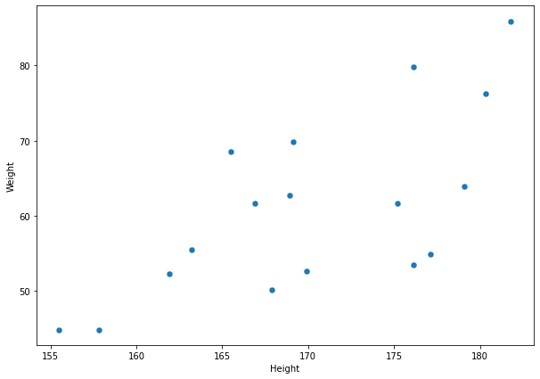

# Data Processing
## 1. 결측치
- 전체 데이터의 특징을 확인할 수 없게 만든다.
- 표현방법
  - NA(na)
  - NaN
  - Null
  - '' (공백)
  
<br>

- 결측치 확인
  1. `.value_counts(dropna=False)` : 결측치를 포함하여 빈도분석 결과 출력 | dropna=True가 default임을 알고있자
  2. `.isnull()` : 결측치를 True로 출력
     - `.isnull.sum(axis=0)` : 각 열(Column)별로 결측치 개수 확인 | python은 True+True=2 처럼 bool타입을 연산할 수 있음을 이용
     - `.isnull.sum(axis=1)` : 각 행(Row)별로 결측치 개수 확인
  3. `.notnull()` : 결측치를 False로 출력


    - 결측치 막대 그래프
        ```python
        import missingno as msno

        msno.bar(TD,
                figsize = (15, 7),
                color = (0.2, 0.2, 0.8))    # RGB를 퍼센트로 줌
        ```
        

    <br>

    - 결측치 Matrix : 결측치가 어디에 위치해 있는지 보여줌. 하얀 부분이 결측치
        ```python
        msno.matrix(TD,
                figsize = (15, 7),
                color = (0.8, 0.2, 0.2))
        ```
        

<br>

- 결측치 삭제 : 열 삭제 또는 행 삭제
  - `.dropna(thresh=n, axis=1)` : n개 이하 측정값(Non-Null)이 있는 열 삭제
  - `.dropna(subset=['age'], how='any', axis=0)` : age행을 기준으로 결측치가 있는 행 삭제
    - how = 'any' : 기본값  &rarr; 행 또는 열에서 하나 이상의 결측치가 있는 경우 해당 행 또는 열이 삭제된다. 즉, 결측치가 하나라도 있으면 해당 행/열이 삭제
    - how = 'all' : 행/열에서 모든 값이 결측치인 경우에만 해당 행/열이 삭제.

<br>

- 결측치 치환 (숫자, 문자)
  - `.fillna(int(DF['age'].mean(axis=0)), inplace = True)` : 연속형 데이터 치환, 결측치를 평균값으로 치환 [숫자]
  - `.fillna(most_freq,inplace = True)` : 명목형 데이터 치환, 결측치를 최빈값으로 치환 [문자]
    ```python
    most_freq = TD['embark_town'].value_counts(dropna = True).idxmax() # 'Southampton'리턴. Southamton이 인덱스값
    TD['embark_town'].fillna(most_freq, inplace = True)
    ```
  - `.fillna(method='ffill', inplace = True)` : 이전 데이터포인트로 치환
  - `.fillna(method='bfill', inplace = True)` : 다음 데이터포인터로 치환

<br>

## 2. Filtering
- 나이가 10살 이상이면서 20살 미만 
    ```python
    Filter_1 = (TD.age >= 10) & (TD.age < 20)

    D.loc[Filter_1, :].head()
    ``` 
<br>

## 3. 데이터프레임 합치기
- `.concat()` : 연결시키는 느낌
  ```python
  pd.concat([TB1, TB2], axis = 0)   # 행의 방향으로 테이블 합침
  ```
  

    <br>

  ```python
  pd.concat([TB1, TB3], axis = 0, ignore_index = True)  # ignore_index = True : 라벨 새로 구성
  ```
  
  
    <br>

  ```python
  pd.concat([TB1, TB2], axis = 1)
  ```
  
  
<br>

- `merge()`
  ```python
  pd.merge(TB1, TB2, on = ['Name', 'Gender'])
  ```
  
  
<br>

## 4. 그룹연산
- `groupby()`
  ```python
  grouped = TD.groupby(['class']) # class를 기준으로 DataFrameGroupBy 객체 생성 -> 1등실, 2등실, 3등실
  grouped   # <pandas.core.groupby.generic.DataFrameGroupBy object at 0x7ad8526826b0>
  grouped.get_group('First').head(3)
  ```
  

  <br>

  ```python
  for key in ['First', 'Second', 'Third']:
  print(grouped.get_group(key).head(3))
  print('\n')
  ```
  

  <br>

- `groupby()` - 'class' & 'sex' 기준
  ```python
  grouped_TWO = TD.groupby(['class', 'sex'])
  grouped_TWO.get_group(('First', 'female')).head(3)

  for key, group in grouped_TWO:
  print('* key :', key)
  print('* number :', len(group))
  print(group.head(3))
  print('\n')
  ```

  
  ```shell
  * key : ('First', 'female')
  * number : 94
       age     sex  class     fare  survived
  1   38.0  female  First  71.2833         1
  3   35.0  female  First  53.1000         1
  11  58.0  female  First  26.5500         1


  * key : ('First', 'male')
  * number : 122
       age   sex  class      fare  survived
  6   54.0  male  First   51.8625         0
  23  28.0  male  First   35.5000         1
  27  19.0  male  First  263.0000         0


  * key : ('Second', 'female')
  * number : 76
       age     sex   class     fare  survived
  9   14.0  female  Second  30.0708         1
  15  55.0  female  Second  16.0000         1
  41  27.0  female  Second  21.0000         0


  * key : ('Second', 'male')
  * number : 108
       age   sex   class  fare  survived
  17   NaN  male  Second  13.0         1
  20  35.0  male  Second  26.0         0
  21  34.0  male  Second  13.0         1


  * key : ('Third', 'female')
  * number : 144
       age     sex  class     fare  survived
  2   26.0  female  Third   7.9250         1
  8   27.0  female  Third  11.1333         1
  10   4.0  female  Third  16.7000         1


  * key : ('Third', 'male')
  * number : 347
      age   sex  class    fare  survived
  0  22.0  male  Third  7.2500         0
  4  35.0  male  Third  8.0500         0
  5   NaN  male  Third  8.4583         0
  ```
  
  <br>

- `agg()`
  ```python
  grouped_TWO.agg(['mean', 'std'])  # 멀티 인덱스 : 인덱스가 class, sex이다.
  ```
  
 
  <br>

  ```python
  grouped.agg({'fare' : ['min', 'max'], 'age' : ['mean', 'std']})   # fare, age열에 각각 다른 함수 적용
  ```
  

  <br>

- `filter()`  
  ```python
  grouped.filter(lambda x : len(x) >= 200).head()   # 데이터 개수가 200개 이상인 그룹의 결과만 필터링
  grouped.apply(len)
  ```
  
  ```shell
    class
    First     216
    Second    184
    Third     491
    dtype: int64
  ```

  <br>

  ```python
  grouped.filter(lambda x: x.age.mean() < 30).tail()    # 나이의 평균이 30보다 작은 그룹의 결과만 필터링
  grouped.age.mean()
  ```
  
  ```shell
    class
    First     38.233441
    Second    29.877630
    Third     25.140620
    Name: age, dtype: float64
  ```

<br>

## 5. pivot_table()
- 한 개의 적용함수
    ```python
    TD_1 = pd.pivot_table(TD,
                        index = 'class',   # 만들어지는 TD_1의 index 영역이 class가 됨
                        columns = 'sex',   # 만들어지는 TD_1의 열이 sex가 됨
                        values = 'age',    # TD_1의 값들은 age
                        aggfunc = 'mean')  # 값을 채울 때, 평균으로 채운다.

    TD_1
    ```
    

    <br>

- 두 개의 적용함수
    ```python
    TD_2 = pd.pivot_table(TD,
                        index = 'class',
                        columns = 'sex',
                        values = 'survived',
                        aggfunc = ['mean', 'sum'])  # 평균 생존률, 생존자 수

    TD_2
    ```
    

    <br>

- 다중 인덱스, 다중 데이터, 다중 함수
    ```python
    TD_3 = pd.pivot_table(TD,
                        index = ['class', 'sex'],
                        columns = 'survived',
                        values = ['age','fare'],
                        aggfunc = {'age' : ['mean', 'std'], 'fare' : ['min', 'max']})

    TD_3
    ```
    

<br>

## 6. Multi-Index
`.xs()` : Cross Section
- 행 멀티인덱스
    ```python
    TD_3.index
    TD_3.xs('First', level = 'class', axis = 0) # class 중에서 First만 보겠다.
    ```

    ```shell
    MultiIndex([( 'First', 'female'),
                ( 'First',   'male'),
                ('Second', 'female'),
                ('Second',   'male'),
                ( 'Third', 'female'),
                ( 'Third',   'male')],
            names=['class', 'sex'])
    ```
    

    <br>

    ```python
    TD_3.xs(('First', 'male'), level = ['class', 'sex'], axis = 0)
    ```
    

- 열 멀티인덱스
    ```python
    TD_3.columns
    TD_3.columns.set_names(['Header', 'Fuction', 'Survived'], inplace = True)
    TD_3.columns.set_levels(['Dead', 'Alive'], level = 2, inplace = True)   # Survived의 level=2이고, 0이면 Dead로 1이면 Alive
    ```

    ```shell
    MultiIndex([( 'age', 'mean', 0),    # 사망자의 평균 나이
                ( 'age', 'mean', 1),    # 생존자의 평균 나이
                ( 'age',  'std', 0),
                ( 'age',  'std', 1),
                ('fare',  'max', 0),
                ('fare',  'max', 1),
                ('fare',  'min', 0),
                ('fare',  'min', 1)],
            names=[None, None, 'survived'])

    MultiIndex([( 'age', 'mean', 0),
                ( 'age', 'mean', 1),
                ( 'age',  'std', 0),
                ( 'age',  'std', 1),
                ('fare',  'max', 0),
                ('fare',  'max', 1),
                ('fare',  'min', 0),
                ('fare',  'min', 1)],
            names=['Header', 'Fuction', 'Survived'])

    MultiIndex([( 'age', 'mean',  'Dead'),
                ( 'age', 'mean', 'Alive'),
                ( 'age',  'std',  'Dead'),
                ( 'age',  'std', 'Alive'),
                ('fare',  'max',  'Dead'),
                ('fare',  'max', 'Alive'),
                ('fare',  'min',  'Dead'),
                ('fare',  'min', 'Alive')],
            names=['Header', 'Fuction', 'Survived'])
    ```
    

    <br>

    ```python
    TD_3.xs('Alive', level = 'Survived', axis = 1)  # 생존자 정보
    ```
    

<br>

## 7. etc
  - `.vaule_counts()`
  ```python
  TD[['sex', 'class']].value_counts() # pivot 돌려서 count값 얻은 것과 같음
  ```

  ```shell
  sex     class 
  male    Third     347
  female  Third     144
  male    First     122
          Second    108
  female  First      94
          Second     76
  dtype: int64
  ```

  <br>

  - `.nunique()` : 몇가지나 있나?
  ```python
  TD[['sex', 'class']].nunique()
  ```

  ```shell
  sex      2  # 성별은 2개
  class    3  # 클래스는 3개
  dtype: int64
  ```

  <br>

  - `.replace()`
  ```python
  TD['sex'] = TD['sex'].replace('male', 'MAN')
  TD.loc[TD['sex'] == 'MAN', :][:2]
  ```
  

  <br>

  ```python
  TD[['class']] = TD[['class']].replace({'First':'1st', 'Second':'2nd', 'Third':'3rd'})
  TD.loc[[1, 9, 0], :]    # 1, 9, 0 번만 보자
  ```
  

  <br>

  ```python
  import numpy as np

  TD[['age']] = TD[['age']].replace(np.nan, int(TD.age.mean()))   # 결측치 대체
  TD.loc[[5], :]
  ```
  


# Matplotlib
- 선 그래프
    ```python
    plt.figure(figsize = (10, 7))
    plt.plot(DF.Height,
            linewidth = 1,
            color = 'r',
            marker = '>',
            linestyle = '--')
    plt.title('Line Graph', size = 30)
    plt.xlabel('Index', size = 20)
    plt.ylabel('Height', size = 20)
    plt.grid(True)
    plt.show()
    ```
    

<br>

- 막대 그래프
    ```python
    plt.figure(figsize = (10, 7))
    plt.bar(DF.index,
            DF.Height,
            width = 0.4,
            color = 'y',
            edgecolor = 'b')
    plt.show()
    ```
    

    <br>

    ```python
    plt.figure(figsize = (10, 7))

    plt.bar(DF.index, DF['Height'],
            width = 0.3, label = 'Height')
    plt.bar(DF.index + 0.3, DF['Weight'],
            width = 0.3, label = 'Weight')

    plt.legend()
    plt.show()
    ```
    

    <br>

    ```python
    plt.figure(figsize = (7, 10))

    plt.barh(DF.index,
            width = DF['Height'], height = 0.3,
            label = 'Height')
    plt.barh(DF.index + 0.3,
            width = DF['Weight'], height = 0.3,
            label = 'Weight')

    plt.legend()
    plt.show()
    ```
    

<br>

- 히스토그램
    ```python
    plt.figure(figsize = (10, 7))
    plt.hist(DF.Height,
            bins = 5,
            alpha = 0.5, density = False)   # density : 분포함수
    plt.show()
    ```
    

<br>


- 상자그래프
    ```python
    # 전체 키 분포
    plt.figure(figsize = (10, 7))
    plt.boxplot(DF.Height,
                patch_artist = True)
    plt.show()
    ```
    

    <br>

    ```python
    # 혈액형별 키분포
    plt.figure(figsize = (10, 7))

    plt.boxplot([DF.loc[DF['BloodType'] == 'A', 'Height'],
                DF.loc[DF['BloodType'] == 'B', 'Height'],
                DF.loc[DF['BloodType'] == 'O', 'Height'],
                DF.loc[DF['BloodType'] == 'AB', 'Height']],
                labels = ['A', 'B', 'O', 'AB'],
                patch_artist = True,
                showmeans = True)   # 초록색 삼각형이 평균

    plt.show()
    ```
    
    - 25% ~ 75% : IQR
    - 꼬리가 없고 o 인 애들은 이상치(Outlire)라고 함.
      - 이상치 : 평균에 급격한 영향을 주는 값
      - 절사평균 : 이상치 제거 후 평균 계산
      - 꼬리가 그려지는 범위는 IQR * 1.5 이다. 이것을 넘으면 이상치이고 꼬리를 그리지 않는다.

- 산점도
    ```python
    plt.figure(figsize = (10, 7))
    plt.scatter(DF.Height,
                DF.Weight,
                marker='*',
                s = 100,
                c = '#d62728')
    plt.show()
    ```
    

<br>

- 파이 그래프
    ```python
    plt.figure(figsize = (10, 10))
    plt.pie(DF.BloodType.value_counts(),
            labels = DF.BloodType.value_counts().index,
            autopct = '%.1f%%',
            explode = [0.0, 0.0, 0.0, 0.05],    # 상자 사이의 거리
            startangle = 90) # 12시 방향부터 시작하고 싶을 때
    plt.show()
    ```
    

<br>

- `plt.subplot()`
```python
fig, ax = plt.subplots(nrows = 2, ncols = 2, figsize = (6, 6), facecolor = 'tan')

ax[0, 0].plot()
ax[0, 0].set_facecolor('tomato')
ax[0, 0].set_title('Axes_1')
ax[0, 0].set_xticks([])
ax[0, 0].set_yticks([])

ax[0, 1].plot()
ax[0, 1].set_facecolor('royalblue')
ax[0, 1].set_title('Axes_2')
ax[0, 1].set_xticks([])
ax[0, 1].set_yticks([])

ax[1, 0].plot()
ax[1, 0].set_facecolor('limegreen')
ax[1, 0].set_title('Axes_3')
ax[1, 0].set_xticks([])
ax[1, 0].set_yticks([])

ax[1, 1].plot()
ax[1, 1].set_facecolor('plum')
ax[1, 1].set_title('Axes_4')
ax[1, 1].set_xticks([])
ax[1, 1].set_yticks([])

plt.show()
```


<br>

```python
fig, ax = plt.subplots(nrows = 1, ncols = 2, figsize = (15, 5))

ax[0].hist(DF.Height,
           bins = 5, alpha = 0.3,
           density = False)
ax[1].hist(DF.Height,
           bins = 5, alpha = 0.7,
           density = True)

ax[0].set_title('Histogram-1', size = 20)
ax[1].set_title('Histogram-2', size = 20)

ax[0].set_xlabel('Height', size = 15)
ax[1].set_xlabel('Height', size = 15)

ax[0].set_ylabel('Frequency', size = 15)
ax[1].set_ylabel('Density', size = 15)

plt.show()
```


<br>

```python
fig, ax = plt.subplots(nrows = 2, ncols = 2, figsize = (15, 10))

ax[0, 0].bar(DF.index, DF['Height'], width = 0.3, label = 'Height')
ax[0, 0].bar(DF.index + 0.3, DF['Weight'], width = 0.3, label = 'Weight')

ax[0, 1].boxplot([DF.loc[DF['BloodType'] == 'A', 'Height'],
                  DF.loc[DF['BloodType'] == 'B', 'Height'],
                  DF.loc[DF['BloodType'] == 'O', 'Height'],
                  DF.loc[DF['BloodType'] == 'AB', 'Height']],
                  labels = ['A', 'B', 'O', 'AB'], patch_artist = True,
                 showmeans = True)

ax[1, 0].scatter(DF.Height, DF.Weight,
                 marker='*', s = 100, c = '#d62728')

ax[1, 1].pie(DF.BloodType.value_counts(),
             labels = DF.BloodType.value_counts().index,
             autopct = '%.1f%%', startangle = 90,
             explode = [0.0, 0.0, 0.0, 0.05])

ax[0, 0].legend()

ax[0, 0].set_title('Bar Plot')
ax[0, 1].set_title('Box Plot')
ax[1, 0].set_title('Scatter Plot')
ax[1, 1].set_title('Pie Plot')

ax[0, 0].set_xlabel('Height & Weight')
ax[0, 1].set_xlabel('Blood Type')
ax[1, 0].set_xlabel('Height')
ax[1, 1].set_xlabel('')

ax[0, 0].set_ylabel('Frequency')
ax[0, 1].set_ylabel('Height')
ax[1, 0].set_ylabel('Weight')
ax[1, 1].set_ylabel('')

plt.show()
```


<br>

# Seaborn
- 선 그래프
```python
plt.figure(figsize = (10, 7))
sns.lineplot(x = DF.index,
             y = DF.Height,
             linewidth = 1,
             color = 'r',
             marker = '>',
             linestyle = '--')
plt.title('Line Graph', size = 30)
plt.xlabel('Index', size = 20)
plt.ylabel('Height', size = 20)
plt.grid(True)
plt.show()
```


<br>

- 막대 그래프
  - 연속형 - `.barplot()`
    ```python
    plt.figure(figsize = (10, 7))
    sns.barplot(data = DF,
                x = DF.index,
                y = 'Height')
    plt.show()
    ```
    
  
  - 명목형 - `.countplot()`
    ```python
    plt.figure(figsize = (10, 7))
    sns.countplot(data = DF,
                x = 'BloodType')
    plt.show()
    ```
    

    <br>

    ```python
    plt.figure(figsize = (10, 7))
    sns.countplot(data = DF,
                x = 'BloodType',
                hue = 'Gender')
    plt.show()
    ```
    

    <br>

    ```python
    plt.figure(figsize = (7, 10))
    sns.countplot(data = DF,
                y = 'BloodType',
                hue = 'Gender')
    plt.show()
    ```
    

<br>

- 히스토그램
    ```python
    plt.figure(figsize = (10, 7))
    sns.histplot(data = DF,
                x = 'Height',
                bins = 5,
                alpha = 0.3)
    plt.show()
    ```
    

<br>

- 상자 그래프
    ```python
    plt.figure(figsize = (10, 7))
    sns.boxplot(data = DF,
                x = 'BloodType',
                y = 'Height',
                order = ['A', 'B', 'O', 'AB'])
    plt.show()
    ```
    

<br>

- 산점도
    ```python
    plt.figure(figsize = (10, 7))
    sns.scatterplot(data = DF,
                    x = 'Height',
                    y = 'Weight',
                    s = 50)
    plt.show()
    ```
    

<br>

- 바이올린 그래프
    ```python
    plt.figure(figsize = (10, 7))
    sns.violinplot(data = DF,
                x = 'Gender',
                y = 'Age')
    plt.show()
    ```
    

<br>

- Histograms
    ```python
    fig, ax = plt.subplots(nrows = 1, ncols = 2, figsize = (15, 5))

    sns.histplot(data = DF, x = 'Height',
                bins = 5, alpha = 0.2,
                kde = True, ax = ax[0])
    sns.distplot(x = DF['Height'],
                bins = 5, kde = True, color = 'royalblue',
                hist = False, rug = True, ax = ax[1])

    ax[0].set_title('Histogram-1', size = 20)
    ax[1].set_title('Histogram-2', size = 20)

    ax[0].set_xlabel('Height', size = 15)
    ax[1].set_xlabel('Height', size = 15)

    ax[0].set_ylabel('Frequency', size = 15)
    ax[1].set_ylabel('Density', size = 15)

    plt.show()
    ```
    

<br>

- Multiple Plots
    ```python
    fig, ax = plt.subplots(nrows = 2, ncols = 2, figsize = (15, 10))

    sns.barplot(data = DF, x = 'Grade', y = 'Age',
                hue = 'Gender', ci = None, ax = ax[0, 0])

    sns.histplot(data = DF, x = 'Weight',
                bins = 6, alpha = 0.3, ax = ax[0, 1])

    sns.boxplot(data = DF, x = 'BloodType', y = 'Height',
                order = ['A', 'B', 'O', 'AB'], ax = ax[1, 0])

    sns.scatterplot(data = DF, x = 'Height', y = 'Weight',
                    hue = 'Grade', style = 'BloodType', s = 50, ax = ax[1, 1])

    # 'best', 'upper right', 'upper left', 'lower left', 'lower right'
    # 'right', 'center left', 'center right', 'lower center', 'upper center', 'center'
    ax[0, 0].legend(labels = ['Male','Female'], loc = 'upper left', title = 'Gender')

    ax[0, 0].set_title('Bar Plot')
    ax[0, 1].set_title('Histogram')
    ax[1, 0].set_title('Box Plot')
    ax[1, 1].set_title('Scatter Plot')

    ax[0, 0].set_xlabel('Grade')
    ax[0, 1].set_xlabel('Weight')
    ax[1, 0].set_xlabel('Blood Type')
    ax[1, 1].set_xlabel('Height')

    ax[0, 0].set_ylabel('Age Mean')
    ax[0, 1].set_ylabel('Frequency')
    ax[1, 0].set_ylabel('Height')
    ax[1, 1].set_ylabel('Weight')

    plt.show()
    ```
    
