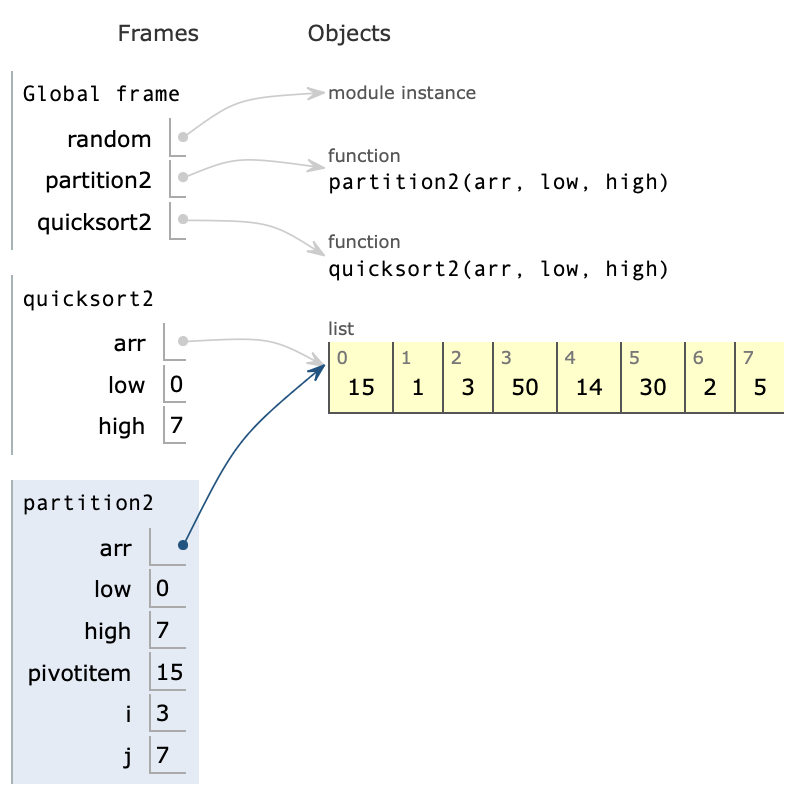
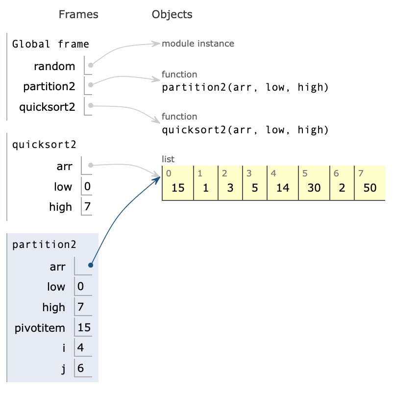

# 분할정복
- 분할 : 문제의 사례를 둘 이상의 충분히 작은 사례롤 분할
- 정복 : 작은 사례를 각각 정복
- 통합 : 필요하면, 작은 사례의 해답을 통합해 원래 사례의 해답을 도출
- [e_devide_conqure 폴더](https://github.com/Imshyeon/Algorithm/tree/main/e_devide_conqure) 참고
    1. a~.py : merge sort
    2. b~.py : quick sort
    3. c~.py : 분할정복 문제 풀이

<br>

1. Merge Sort

    

    *이미지 출처 : [위키백과-합병 정렬](https://ko.wikipedia.org/wiki/합병_정렬)*

    - 분할 : 요소가 n개인 S를 n/2개의 원소를 가진 두 개의 리스트로 분할, 더이상 분할할 수 없을 때까지 동일한 유형의 여러 하위 문제로 나눈다.
    - 정복 : 가장 작은 단위의 하위 문제를 해결하여 정복한다.
    - 조합 : 하위 문제에 대한 결과를 원래 문제에 대한 결과로 조합한다.

    - 진행이 될수록 메모리를 많이 차지한다. (공간복잡도 증가) => 개선안 : a_merge_sort2.py 참고

<br>

2. Quick Sort

    

    *이미지 출처 : [위키백과-퀵 정렬](https://ko.wikipedia.org/wiki/퀵_정렬)*
    * 내부정렬 : 추가적인 배열을 사용하지 않는 정렬
    - 분할 : 기준 원소를 정해서 기준 원소를 기준으로 좌우로 분할
    - 정복 : 왼쪽의 리스트와 오른쪽의 리스트를 각각 재귀적으로 퀵 정렬
    - 조합 : 조합해서 결과 리턴

    <br>

    ```python
    def partition2(arr, low, high):
    pivotitem = arr[low]
    i = low + 1
    j = high
    
    while (i <= j) :
        while arr[i] < pivotitem:
            i += 1
            if i > j: break
            
        while arr[j] > pivotitem:
            j -= 1
            if j < i: break
            
        if i <= j :
            arr[i], arr[j] = arr[j], arr[i] # 요소의 위치 바꿈
            i += 1  # 위치를 바꾼 뒤, 인덱스의 한칸 이동
            j -= 1  # 위치를 바꾼 뒤, 인덱스의 한칸 이동
            
    pivotpoint = j
    arr[low], arr[pivotpoint] = arr[pivotpoint], arr[low]
    return pivotpoint


    def quicksort2(arr, low, high):
        if low <= high:
            pivotpoint = partition2(arr, low, high)
            quicksort2(arr, low, pivotpoint -1)
            quicksort2(arr, pivotpoint+1, high)
    ```
    <br>

    - 위치 바뀌기 전

     

        1. pivotitem = 15이고, i=2까지의 값들은 피봇보다는 작은 값들이었기 때문에 i += 1 라인만 수행했다.
        2. i = 3이 되는 순간에 해당 요소는 피봇 값보다 크게 되므로 arr[j]와 피봇을 비교하는 연산 시작
        3. arr[j]는 피봇보다 작게 되므로 while을 수행하지 않고 밑의 if문으로 간다.
        4. 그림을 보면, arr[3] = 50, arr[7]=5이고 arr[7]이 arr[3]보다 값이 작음에도 불구하고 인덱스 값(위치)은 더 큰 것을 알 수 있다. 따라서 둘의 위치를 변경해주어야 정렬이 가능하다.
        5. 둘의 위치를 바꾸어 정렬한 후, 인덱스 위치 이동

    <br>

    - 위치 바뀐 후

    

<br>

# 이진탐색트리
- 이진탐색과 연결리스트를 결합한 자료구조.
- 이진탐색의 탐색 능력과 linked list의 추가, 삭제 능력을 함께 고려.
- [b_datastructure 참고](https://github.com/Imshyeon/Algorithm/tree/main/b_datastructure)
    1. b_datastructure/e_bst.py : 이진탐색 트리 구현
    2. b_datastructure/tests/e_bst_test.py : 이진탐색트리의 테스트 파일

    
    
    *이미지 출처 : [위키백과-이진탐색트리](https://ko.wikipedia.org/wiki/이진_탐색_트리)*

    - 이진 탐색 트리에서 가장 위에 있는 애들을 Root. 동그라미를 Node
    - 노드의 왼쪽 서브트리에는 그 노드의 값보다 작은 값들을 지닌 노드들로 이루어짐
    - 노드의 오른쪽 서브트리에는 그 노드의 값보다 큰 값을 지닌 노드들로 이루어짐

    <br>

## 깊이우선탐색


1. 전위 순회 : 현재 노드 출력 -> 왼쪽 노드 방문 -> 오른쪽 노드 방문
    - 8 - 3 - 1 - 6 - 4 - 7 - 10 - 14 - 13
2. **중위 순회** : 왼쪽 노드 방문 -> 현재 노드 출력 -> 오른쪽 노드 방문 => 순서대로 출력이 된다. (방문하고 왼쪽 노드 없으면 출력)
    - 1 - 3 - 4 - 6 - 7 - 8 - 10 - 13 - 14
3. 후위 순회 : 왼쪽 노드 방문 -> 오른쪽 노드 방문 -> 현재 노드 출력 
    - 1 - 4 - 7 - 6 - 3 - 13 - 14 - 10 - 8


## 너비우선탐색
- 시작 정점을 방문한 후 시작 정점에 인접한 모든 정점들을 우선 방문하는 방법이다. Open List는 큐를 사용해야만 레벨 순서대로 접근이 가능.

    

    *이미지 출처 : [위키백과-너비우선탐색](https://ko.wikipedia.org/wiki/너비_우선_탐색)*


