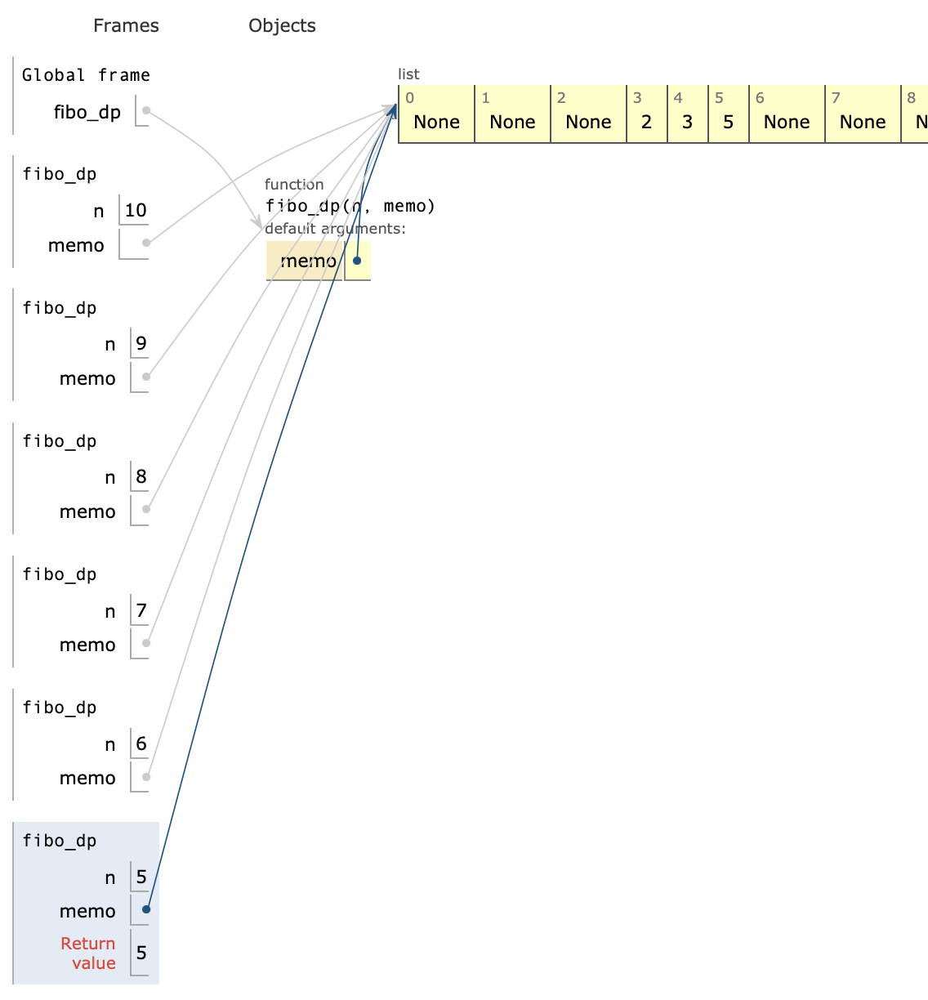
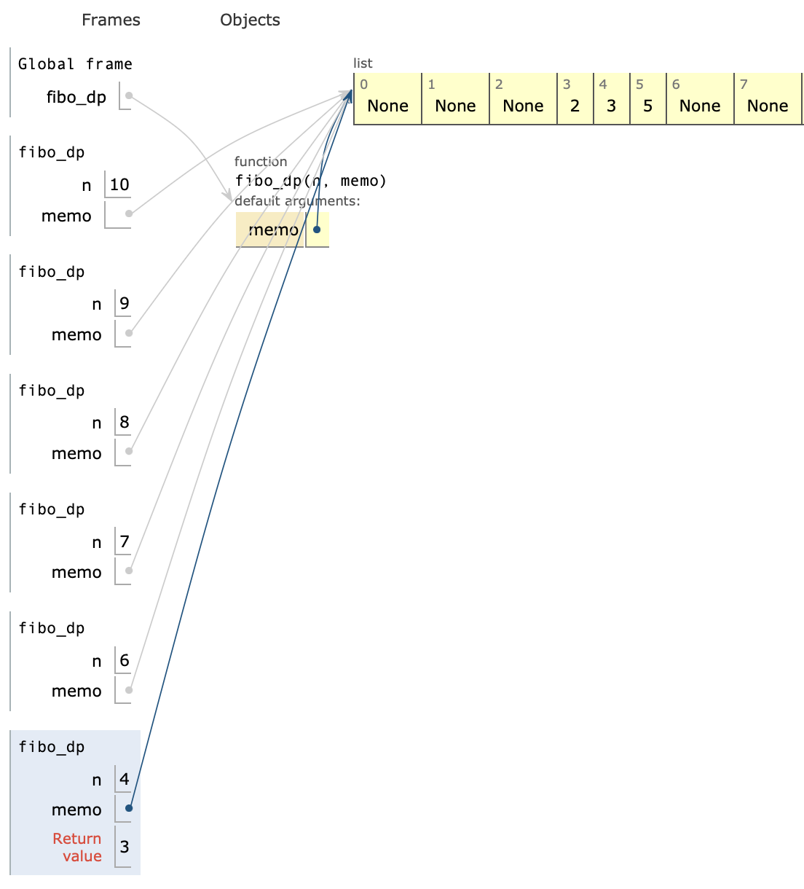
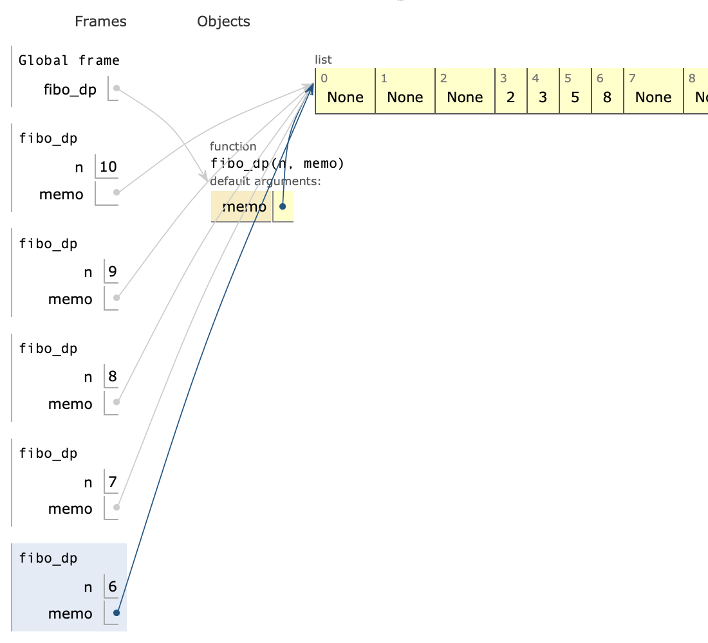
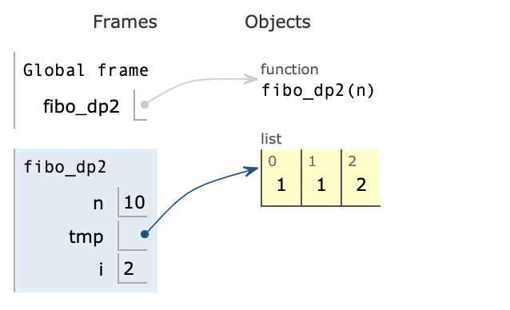
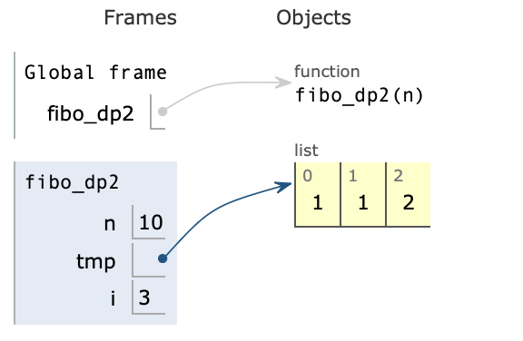
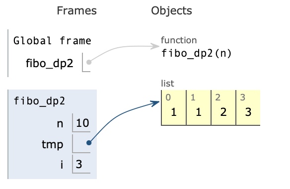
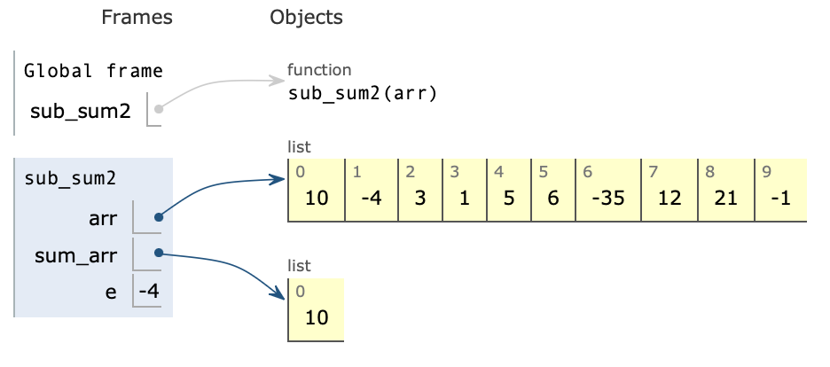
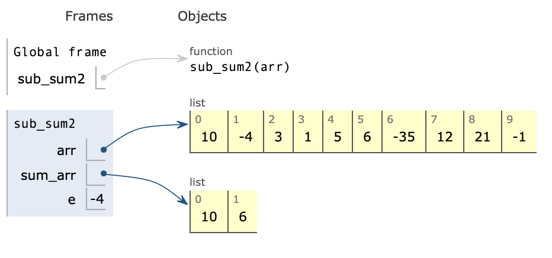

# 탐욕법
- 최종 해답을 찾기 위해 각 단계마다 하나의 답을 고름
- 각 단계에서 답을 고를 때 가장 좋아 보이는 답을 선택
- **한번의 선택이 다음 선택과 무관해야함**
- 매 순간의 최적의 선택이 문제에 대한 최적의 선택(최적 부분 구조)
- 전체탐색이 아니라 매우 빠름.

* 각 단계의 최적의 답이 최종 해답에서도 최적이라는 것을 보장하지 않음.

<br>

# 동적 프로그래밍
- 문제를 작은 문제로 분할
- Top-down 혹은 Bottom-up 방식으로 문제를 해결
- 가장 작은 입력 사례의 해답을 테이블에 저장하고 필요할 때 연산에 활용(Memorization)


    1. 피보나치 수열을 동적 프로그래밍으로 만들기 - 1

    ```python
    def fibo_dp(n, memo=[None for _ in range(100)]):
    if n == 0:
        return 0
    
    if n <= 2 :
        return 1
    
    if memo[n] is not None: # 이전에 계산해 둔 값이 있다면 수행 = fibo(n-2) 계산 시 사용됨.
        return memo[n]
    
    # n-1 쪽은 연산을 하고, n-2 재귀가 도는 시점에는 직전에 연산한 값이 들어있다.
    # 아래의 식에서 fibo(n-1)이 우선적으로 모두 계산된 뒤, fibo(n-2)가 수행이 된다.
    memo[n] = fibo_dp(n-1, memo) + fibo_dp(n-2, memo) 
    return memo[n]
    
    print(fibo_dp(10))
    ```

    
    
    - `memo[6] = fibo_dp(5,memo) + fibo_dp(4,memo)` 이다. 해당 코드를 재귀적으로 진행하면서 리스트의 3,4번 인덱스에는 그림과 같이 값이 차있다.

    

    

    <br>

    2. 피보나치 수열을 동적 프로그래밍으로 만들기 - 2

    ```python
    def fibo_dp2(n):
    tmp = []
    tmp.append(1)
    tmp.append(1)
    
    if n < 2: return tmp[-1]    #이전 피보나치 수열의 값 저장
    
    for i in range(2,n):
        tmp.append(tmp[i-2] + tmp[i-1])
        
    return tmp[-1]

    print(fibo_dp2(10))
    ```

    

    

    

    <br>

    3. 예제 문제 풀어보기
    ```python
    def sub_sum2(arr):
    sum_arr = [arr[0]]
    
    for e in arr[1:]:
        sum_arr.append(max(sum_arr[-1]+e, e))   # 둘 중에 큰 값이 담김
    
    return max(sum_arr)
    
    print(sub_sum2([10,-4,3,1,5,6,-35,12,21,-1]))
    ```

    

    

    <br>
